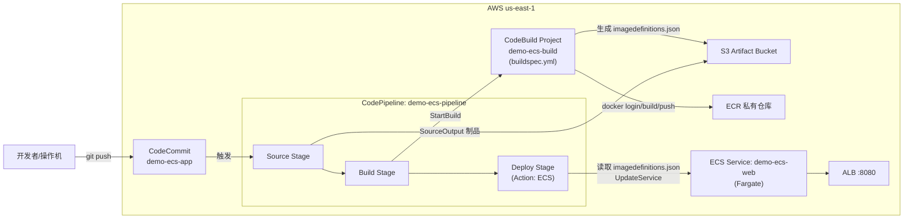
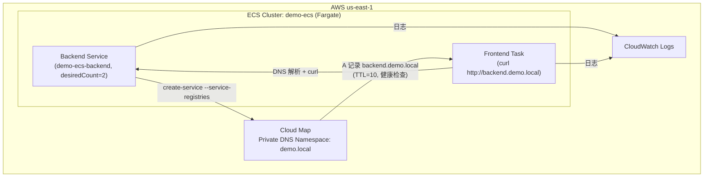
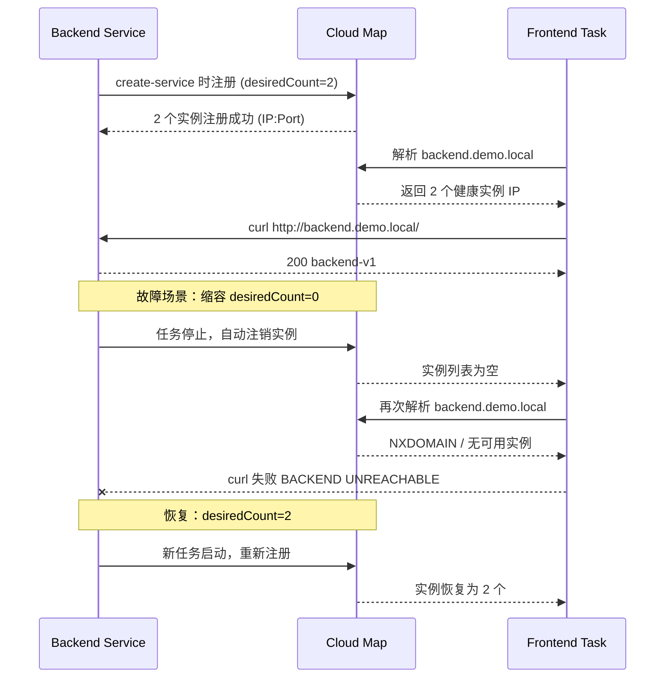
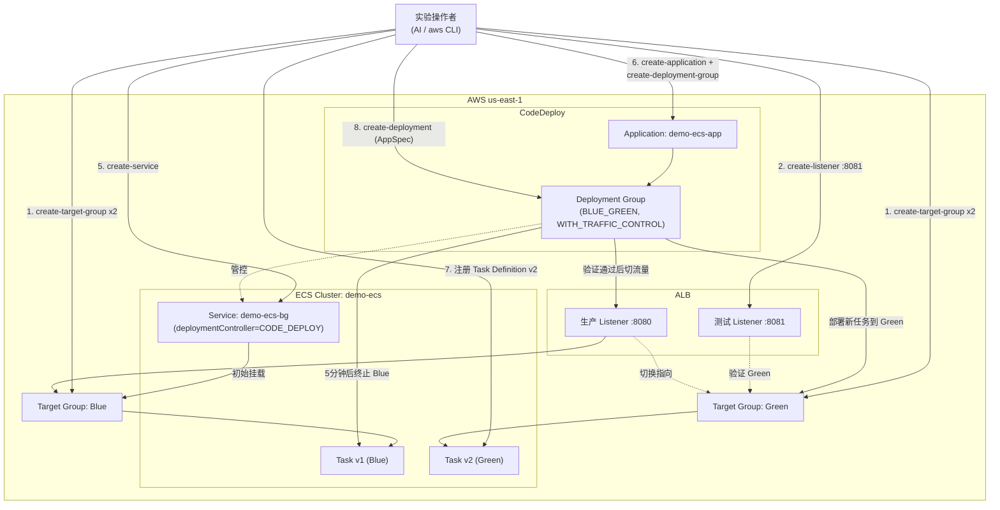

# 架构文档

本仓库包含 10 个基础主线 Demo + 4 个进阶专题 Demo，这里不做全量架构图汇总，只对其中组件交互较复杂、值得可视化的 Demo 提供架构图；其余 Demo 请直接看对应的 `docs/demoXX-*.md`。

选取标准：跨多个 AWS 服务编排、存在明确的多步骤调用链路。据此选出 3 个 Demo：**Demo10（CodePipeline CI/CD）**、**Demo12（Service Discovery / Cloud Map）**、**Demo13（CodeDeploy 蓝绿发布）**。

---

## Demo10 — CodePipeline 自动部署 ECS

Demo10 搭建一条完整的 CI/CD 流水线：源码提交到 CodeCommit 触发 Pipeline，Source 阶段拉取代码，Build 阶段用 CodeBuild 执行 `buildspec.yml`（登录 ECR → docker build/tag/push → 生成 `imagedefinitions.json`），Deploy 阶段用 CodePipeline 原生的 ECS 部署 Action 读取 `imagedefinitions.json` 并滚动更新 `demo-ecs-web` Service。三个 IAM Role（CodeBuild Role、CodePipeline Role，以及 Pipeline 对 Task/Execution Role 的 `iam:PassRole`）串联起整条链路。

流水线的核心是三次角色切换：CodeBuild Role 只能推镜像和写 Artifact Bucket；CodePipeline Role 除了编排各阶段，还需要对 Execution Role / Task Role 有 `iam:PassRole` 权限才能把新 Task Definition 交给 ECS 部署——这是本 Demo 里最容易被忽略、也最值得在架构图之外单独理解的一处权限细节。

---

## Demo12 — Service Discovery 与 Service Connect

Demo12 用 Cloud Map 私有 DNS Namespace（`demo.local`）实现 ECS 服务间的服务发现：Backend Service 创建时把自己注册进 Cloud Map（`backend.demo.local`），Frontend Task 通过 DNS 解析该域名访问 Backend；Demo 还刻意演练了 Backend 缩容到 0 后 Cloud Map 实例清空、Frontend 访问失败的故障场景，再恢复验证。

**服务发现与故障恢复时序**（体现动态注册/注销，而非静态拓扑）：

---

## Demo13 — CodeDeploy 蓝绿发布

Demo13 在独立的 `demo-ecs-bg` Service 上演示 ECS + CodeDeploy 的蓝绿部署：ALB 上并存生产 Listener（:8080）和测试 Listener（:8081），分别指向 Blue/Green 两个 Target Group。注册新 Task Definition 后提交 AppSpec，CodeDeploy 先把新任务挂到 Green 做测试流量验证，再把生产 Listener 切到 Green，原 Blue 任务延迟终止，失败时按 `auto-rollback-configuration` 自动回滚。

